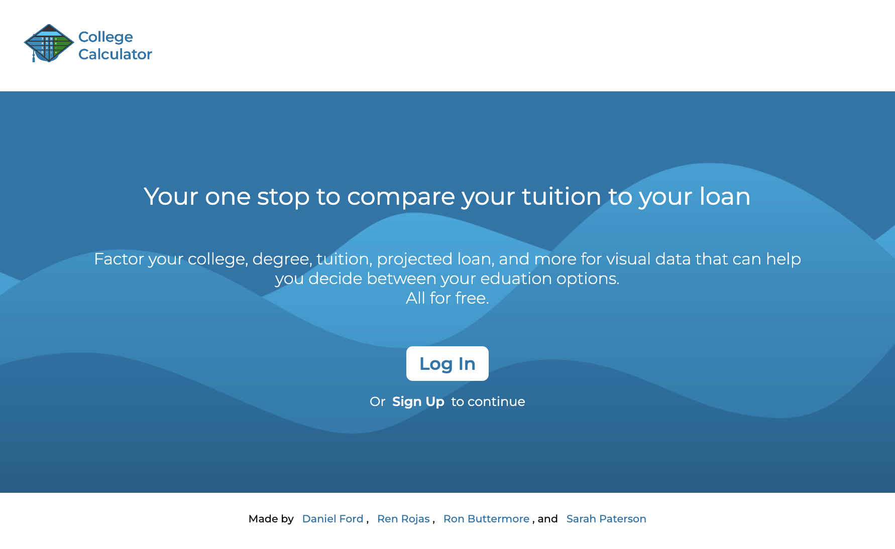
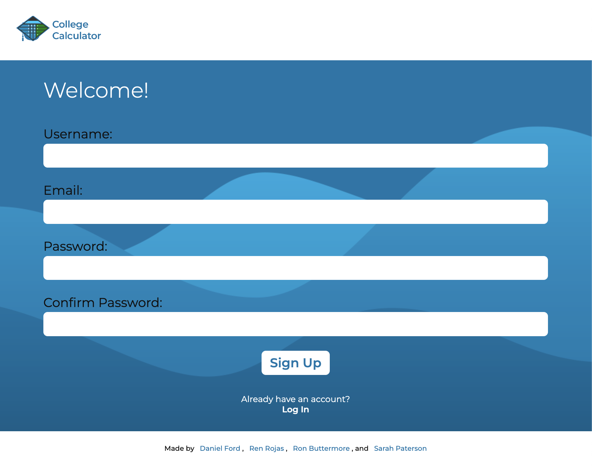
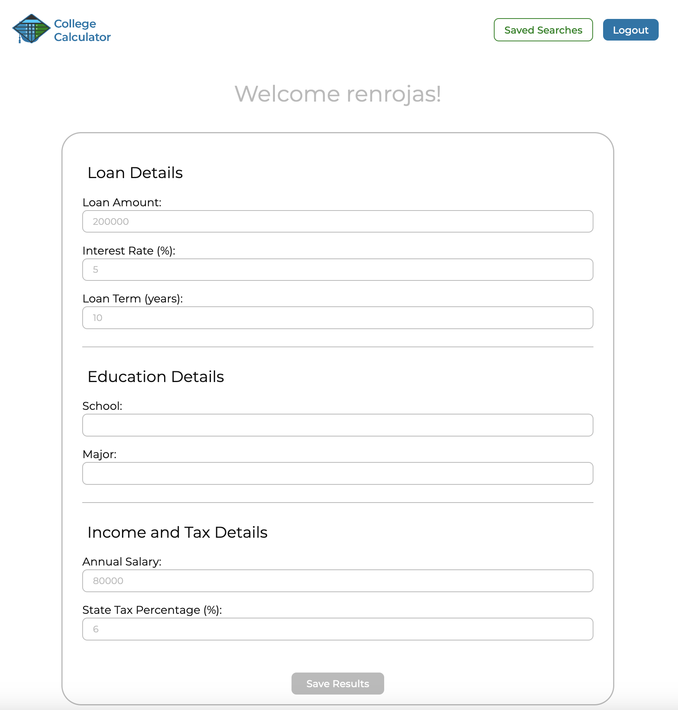
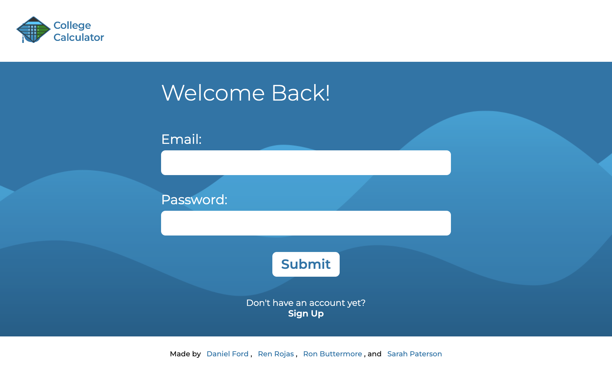

# College Calculator

## Description
This application is designed for anyone that is looking into attending a college or university and needs the extra help with financial planning.

### Daniel's Learning

### Ren's Learning
What I learned is that debugging can take take more time than we plan it to. So it is better to plan out with a lot of time remaining so that it can get done. I also learned that React and CSS do not always get along and some styling can be overwritten if they have the same names in different components. React was also a good challenge which taught me how to use handleSubmit and handleChange while passing objects as props from another component.

### Ron's Learning

### Sarah's Learning

### USER STORY
- **AS A** person who is seeking to go to a college or university,

- **I WANT** an analytics tool that will take loan, school and salary projection information as input values then generate charts and tables that illustrate how this decision will impact my personal finances well into the future.

- **SO THAT** I am fully informed and can get some financial planning done before deciding the school and major I want to pursue.

### ACCESSIBILITY CRITERIA

## Table of Contents
[Installation](#Installation)
[Usage](#Usage)
[License](#License)
[Contributing](#Contributing)
[Questions](#Questions)

## Installation
Project Repository on GitHub: https://github.com/ronbuttermore/college-calculator
Project on Heroku: 

## Usage
1. To use, go to live website on Heroku where you will be directed to the main page.

2. Select the option to Sign Up and fill out the empty fields.

3. Once signed up, you will be greeted with a form to enter all of the financial and school data to generate the graphs to help decide between your education options. Once done, you are welcome to click on "Save Results" where you can access them at a later time.

4. If you log out at any time, you can follow Step 1 and click on Log In and fill out the required fields.

## License

MIT License

Copyright (c) 2023 Daniel Ford, Ren Rojas, Ron Buttermore, and Sarah Paterson

Permission is hereby granted, free of charge, to any person obtaining a copy
of this software and associated documentation files (the "Software"), to deal
in the Software without restriction, including without limitation the rights
to use, copy, modify, merge, publish, distribute, sublicense, and/or sell
copies of the Software, and to permit persons to whom the Software is
furnished to do so, subject to the following conditions:

The above copyright notice and this permission notice shall be included in all
copies or substantial portions of the Software.

THE SOFTWARE IS PROVIDED "AS IS", WITHOUT WARRANTY OF ANY KIND, EXPRESS OR
IMPLIED, INCLUDING BUT NOT LIMITED TO THE WARRANTIES OF MERCHANTABILITY,
FITNESS FOR A PARTICULAR PURPOSE AND NONINFRINGEMENT. IN NO EVENT SHALL THE
AUTHORS OR COPYRIGHT HOLDERS BE LIABLE FOR ANY CLAIM, DAMAGES OR OTHER
LIABILITY, WHETHER IN AN ACTION OF CONTRACT, TORT OR OTHERWISE, ARISING FROM,
OUT OF OR IN CONNECTION WITH THE SOFTWARE OR THE USE OR OTHER DEALINGS IN THE
SOFTWARE.

## How to Contribute
To contribute, please contact https://github.com/DanielFord11, https://github.com/renrojas, https://github.com/ronbuttermore, https://github.com/Sarah-Paterson

## Questions
Please email:
Daniel Ford at <dannyford11@me.com>,
Ren Rojas at <rojas.renn@gmail.com>,
Ron Buttermore at <ron.buttermore@gmail.com>,
Sarah Paterson at <sarahlridings@gmail.com>,
for any additional questions.
